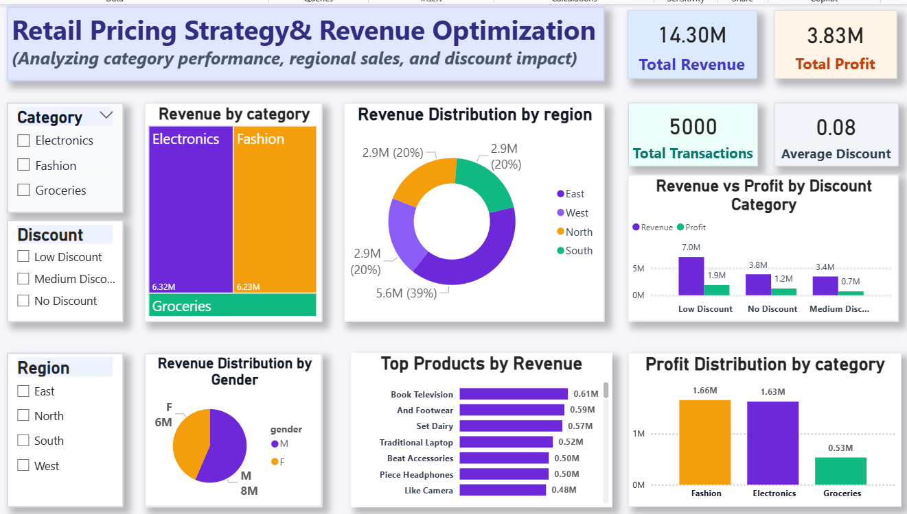

# Retail Sales Performance & Pricing Optimization Analysis

## 📊 Project Overview
This project focuses on analyzing retail sales data to evaluate revenue, profit, and discount impact across regions and categories. The goal is to derive actionable insights to improve pricing strategies and business performance.

---

## 🛠️ Tools & Technologies
- Power BI (Dashboard & Visualization)
- SQL (Data Extraction & Analysis)
- Excel (Data Cleaning & Transformation)

---

## 📈 Key Insights
- Analyzed revenue (14.3M) and profit (3.83M) across multiple regions and categories
- Identified high-performing regions contributing ~39% revenue from the West zone
- Evaluated discount impact on profitability and pricing strategies
- Built KPI-driven dashboards for business decision-making

---

## 📊 Dashboard Preview

---

## 🔍 Key Features
- End-to-end ETL process using SQL and Excel
- Interactive Power BI dashboard with filters and slicers
- Region-wise and category-wise performance analysis
- Data-driven insights for pricing optimization

---

## 📁 Project Structure
- `data/` → Raw and cleaned datasets
- `sql/` → SQL queries
- `dashboard/` → Power BI file (.pbix)
- `images/` → Dashboard screenshots

---

## 🚀 Conclusion
The project provides actionable insights into retail sales performance, helping businesses optimize pricing strategies and improve profitability.

---

## 🔗 Connect With Me
- LinkedIn: https://linkedin.com/in/khushi-jhanwar
- GitHub: https://github.com/Khushi-Jhanwar
